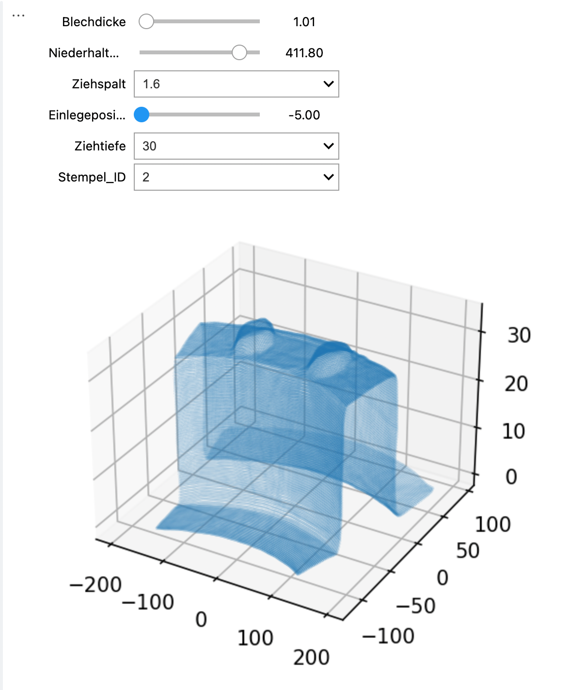

# Usage

## Loading the data

Once the data is loaded as pandas Dataframes, it can be loaded into the `CutPredictor` object:

```python
reg = CutPredictor()

reg.load_data(
    doe = doe,
    data = data,
    process_parameters = [
        'Blechdicke', 
        'Niederhalterkraft', 
        'Ziehspalt', 
        'Einlegeposition', 
        'Ziehtiefe'
    ],
    categorical = [
        'Ziehspalt', 
        'Einlegeposition', 
        'Ziehtiefe'
    ],
    position = 'tp',
    output = 'deviationc',
    index = 'doe_id',
)
```

One has to specify among all the columns present in the frames which ones are process parameters, which one is the input position and which one(s) is the output. If several output variables should be predicted, a list of names should be given. The name of the column contining the experiment ID should be provided.

Optionally, one can specify which process parameter is categorical (as opposed to numerical), i.e. takes discrete values. This only influences the training of the neural network, as categorical attributes are then one-hot encoded before being passed to the NN. This is however optional.

When the data is loaded in the `CutPredictor`, it is normalized to allow for efficient training, so this can take a while depending on the size of your data.

## Training the network

`CutPredictor` uses a feedforward neural network to perform the regression. It is a simple multi-layer perceptron with several layers of neuron, using the mean square error as a loss function. 

The hyperparameters of the NN are:

* the number of layers and neurons.
* the learning rate.
* the dropout level for regularization.
* the batch size.
* the number of epochs

It may be tricky to find the right hyperparameters for your data. Two methods are available: an automatic one using the `optuna` library and a manual one.

### Autotuning

The `autotune` method launches a Bayesian optimization procedure thanks to the `optuna` library to find the best set of hyperparameters for the data. In a nutshell, it will train `trials=100` different networks with hyperparameters sampled ffrom the specified ranges:

```python
best_config = reg.autotune(
    save_path='best_model',
    trials=100,
    max_epochs=50, 
    layers=[3, 5],
    neurons=[64, 256, 64],
    dropout=[0.0, 0.5, 0.1],
    learning_rate=[1e-5, 1e-3]
)
```

The networks have diffrent number of layers, neurons per layer, learning rates and so on. The network with the best validation accuracy is finally selected and saved in the `best_model/` directory. It can be used to make predictions.

The more trials you make, the more likely you will find a satisfying solution if the provided ranges are well chosen. But if the ranges are too wide, you will neeed many trials to find the optimal setup. The autotuning procedure can take a while depending on the number of trials, the size of the networks and the maximum number of epochs.

If you have multiple GPUs on the system, try to limit tensorflow training to one of them (e.g. GPU of id 0). If your code is in a script, use:

```python
CUDA_VIDIBLE_DEVICES=0 python Script.py
```

In a notebook, run that cell first:

```python
import os
os.environ["CUDA_DEVICE_ORDER"] = "PCI_BUS_ID"
os.environ["CUDA_VISIBLE_DEVICES"] = "0"
```

### Manual selection

If you prefer to do the optimization yourself, or fine-tune the architecture found by `autotune` by training it for more epochs, you can define the network using a dictionary:

```python
config = {
    'batch_size': 4096,
    'max_epochs': 50,
    'layers': [128, 128, 128, 128, 128],
    'dropout': 0.0,
    'learning_rate': 0.005
}
```

and train that model:

```python
reg.custom_model(save_path='best_model', config=config, verbose=True)
```

The model's weights are saved in `best_model/`.

## Visualizing the results

To make a prediction for a (potentially new) set of process parameters, simply pass them to the `predict()` method as a dictionary:


```python
x, y = reg.predict({
        'Blechdicke': 1.01, 
        'Niederhalterkraft': 410.0, 
        'Ziehspalt':2.4, 
        'Einlegeposition': -5, 
        'Ziehtiefe': 30
    }, 
    nb_points=1000)
```

This will return 1000 values of the position `x` as well as the corresponding predicted output `y`.

In a Jupyter notebook, you can use the `interactive()` method to get sliders for the process parameters and interactively visualize the predictions:

```python
%matplotlib inline # necessary
plt.rcParams['figure.dpi'] = 150 # bigger figures
reg.interactive()
```



## Loading a pretrained network

Once a suitable model has been trained on the data and saved in 'best_model', it can be used for inference.

If you do not want the data to be loaded for the prediction, you should save the data-related parameters (min/max values of the attributes, etc) in a pickle file:

```python
reg.save_config("network.pkl")
```

This way, you can recreate a `CutPredictor` object without loading the data in memory:

```python
reg = CutPredictor()
reg.load_config("network.pkl")
```

and finally load the weights of the trained model:

```python
reg.load(load_path='best_model')
```

